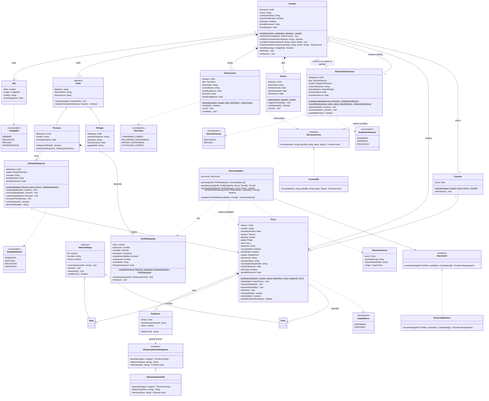

```mermaid
classDiagram
    direction TB

    class Usuario {
        -idUsuario: UUID
        -correo: string
        -contrasenaHash: string
        -correoConfirmado: boolean
        -eliminado: boolean
        -fechaEliminacion: Date
        -fechaRegistro: Date
        +registrar(correo, contrasena, persona)$ Usuario
        +confirmarCorreo(token: TokenCorreo) void
        +verificarContrasena(contrasena: string) boolean
        +cambiarContrasena(actual: string, nueva: string) void
        +solicitarCambioCorreo(contrasena: string, nuevo: string) TokenCorreo
        +tieneRol(codigo: CodigoRol) boolean
        +eliminar() void
        +restaurar() void
    }
    class Rol {
        -idRol: number
        -codigo: CodigoRol
        -nombre: string
        -fechaAsignacion: Date
    }
    class CodigoRol {
        <<enumeration>>
        MIEMBRO
        RESCATISTA
        REFUGIO
        ADMINISTRADOR
    }
    class Perfil {
        <<abstract>>
        #telefono: string
        #fotoPerfilUrl: string
        #descripcion: string
        +actualizar(datos: DatosPerfil) void
        +obtenerContacto(solicitante: Usuario) Contacto
    }
    class Persona {
        -idPersona: UUID
        -nombre: string
        -fechaNacimiento: Date
        +esMayorDeEdad() boolean
        +solicitarVerificacion() SolicitudVerificacion
    }
    class Refugio {
        -idRefugio: UUID
        -nombreInstitucion: string
        -ubicacion: string
        -fechaCreacion: Date
        -paginaWeb: string
    }
    class TokenCorreo {
        -idToken: UUID
        -tipo: TipoToken
        -tokenHash: string
        -correoNuevo: string
        -fechaExpiracion: Date
        -fechaUso: Date
        -fechaInvalidacion: Date
        +generar(usuario: Usuario, tipo: TipoToken)$ TokenCorreo
        +esValido() boolean
        +usar() void
        +invalidar() void
    }
    class TipoToken {
        <<enumeration>>
        CONFIRMAR_CORREO
        RECUPERAR_CONTRASENA
        DEFINIR_CONTRASENA
        ACTUALIZAR_CORREO
    }
    class Sesion {
        -idSesion: UUID
        -tokenHash: string
        -fechaCreacion: Date
        -ultimaActividad: Date
        -fechaCierre: Date
        +abrir(usuario: Usuario)$ Sesion
        +registrarActividad() void
        +estaExpirada() boolean
        +cerrar() void
    }
    class SolicitudVerificacion {
        -idSolicitud: UUID
        -tipo: TipoVerificacion
        -estado: EstadoVerificacion
        -correoSolicitante: string
        -datosRegistro: DatosRefugio
        -fechaSolicitud: Date
        -fechaResolucion: Date
        +crearRescatista(persona: Persona)$ SolicitudVerificacion
        +crearRefugio(correo: string, datos: DatosRefugio)$ SolicitudVerificacion
        +aprobar(admin: Usuario) void
        +rechazar(admin: Usuario) void
        +puedeReenviar() boolean
    }
    class TipoVerificacion {
        <<enumeration>>
        RESCATISTA
        REFUGIO
    }
    class EstadoVerificacion {
        <<enumeration>>
        PENDIENTE
        APROBADA
        RECHAZADA
    }

    Usuario "0..*" --> "1" Rol : tiene
    Rol ..> CodigoRol
    Usuario "1" *-- "0..1" Perfil : perfil
    Perfil <|-- Persona
    Perfil <|-- Refugio
    Usuario "1" *-- "0..*" TokenCorreo : recibe
    TokenCorreo ..> TipoToken
    Usuario "1" *-- "0..*" Sesion : abre
    Usuario "0..1" -- "0..*" SolicitudVerificacion : solicita o es creado al aprobar
    Usuario "0..1" -- "0..*" SolicitudVerificacion : resuelve (admin)
    SolicitudVerificacion ..> TipoVerificacion
    SolicitudVerificacion ..> EstadoVerificacion

    class Perro {
        -idPerro: UUID
        -nombre: string
        -fechaNacimiento: Date
        -tamano: Tamano
        -pesoKg: number
        -pelaje: Pelaje
        -sexo: Sexo
        -ubicacion: string
        -vacunasAlDia: boolean
        -esterilizado: boolean
        -estado: EstadoPerro
        -descripcion: string
        -caracteristicas: string
        -necesidadesEspeciales: string
        -fechaPublicacion: Date
        -eliminado: boolean
        -fechaEliminacion: Date
        +publicar(publicador: Usuario, datos: DatosPerro, fotos: Imagen[])$ Perro
        +editar(datos: DatosPerro) void
        +marcarAdoptado() void
        +marcarDisponible() void
        +eliminar() void
        +calcularEdad() number
        +estaVisible() boolean
        +puedeRecibirSolicitudes() boolean
    }
    class EstadoPerro {
        <<enumeration>>
        DISPONIBLE
        ADOPTADO
    }
    class FotoPerro {
        -idFoto: UUID
        -claveAlmacenamiento: string
        -orden: number
        +obtenerUrl() string
    }
    class ValorCatalogo {
        <<abstract>>
        #id: number
        #nombre: string
        #activo: boolean
        +renombrar(nombre: string) void
        +activar() void
        +desactivar() void
        +estaEnUso() boolean
    }
    class Raza
    class Color
    class Favorito {
        -fecha: Date
        +marcar(usuario: Usuario, perro: Perro)$ Favorito
        +desmarcar() void
    }
    class SolicitudAdopcion {
        -idSolicitud: UUID
        -estado: EstadoSolicitud
        -mensaje: string
        -fechaSolicitud: Date
        -fechaResolucion: Date
        +crear(adoptante: Persona, perro: Perro)$ SolicitudAdopcion
        +aceptar(publicador: Usuario) void
        +rechazar(publicador: Usuario) void
        +cancelar(adoptante: Persona) void
        +rechazarPorSistema() void
        +estaPendiente() boolean
        -generarMensaje() string
    }
    class EstadoSolicitud {
        <<enumeration>>
        PENDIENTE
        ACEPTADA
        RECHAZADA
        CANCELADA
    }

    Usuario "1" --> "0..*" Perro : publica
    Perro "1" *-- "1..5" FotoPerro : tiene
    ValorCatalogo <|-- Raza
    ValorCatalogo <|-- Color
    Perro "0..*" --> "1" Raza : clasifica
    Perro "0..*" --> "1" Color : describe
    Perro ..> EstadoPerro
    Usuario "1" -- "0..*" Favorito : marca
    Favorito "0..*" --> "1" Perro
    Persona "1" --> "0..*" SolicitudAdopcion : envía
    SolicitudAdopcion "0..*" --> "1" Perro : solicita
    SolicitudAdopcion ..> EstadoSolicitud

    class PerfilAdoptante {
        -ritmo: number
        -dedicacion: number
        -vivienda: Vivienda
        -horasSolo: HorasSolo
        -aceptaNecesidades: boolean
        -experiencia: number
        -comentario: string
        -fechaActualizacion: Date
        +guardar(persona: Persona, respuestas: RespuestasTest)$ PerfilAdoptante
        +actualizar(respuestas: RespuestasTest) void
        +eliminar() void
    }
    class Recomendador {
        -servicioIA: IServicioIA
        +generar(perfil: PerfilAdoptante) Recomendacion[]
        -preseleccionar(perfil: PerfilAdoptante, perros: Perro[]) Perro[]
        -calcularAfinidad(perfil: PerfilAdoptante, perro: Perro) number
        -validarRespuesta(respuesta: RespuestaIA, candidatos: Perro[]) boolean
        -respaldoConPlantillas(candidatos: Perro[]) Recomendacion[]
    }
    class Recomendacion {
        +perro: Perro
        +porQueEncaja: string
        +loQueDebesSaber: string
        +origen: OrigenTexto
    }
    class IServicioIA {
        <<interface>>
        +recomendar(perfil: PerfilIA, candidatos: CandidatoIA[]) Promise~RespuestaIA~
    }
    class IServicioCorreo {
        <<interface>>
        +enviar(destino: string, plantilla: string, datos: object) Promise~void~
    }
    class IAlmacenamientoImagenes {
        <<interface>>
        +guardar(imagen: Imagen) Promise~string~
        +obtenerUrl(clave: string) string
        +eliminar(clave: string) Promise~void~
    }
    class ServicioIAExterno {
        +recomendar(perfil: PerfilIA, candidatos: CandidatoIA[]) Promise~RespuestaIA~
    }
    class CorreoSES {
        +enviar(destino: string, plantilla: string, datos: object) Promise~void~
    }
    class AlmacenamientoS3 {
        +guardar(imagen: Imagen) Promise~string~
        +obtenerUrl(clave: string) string
        +eliminar(clave: string) Promise~void~
    }

    Persona "1" *-- "0..1" PerfilAdoptante : responde
    Recomendador ..> PerfilAdoptante : usa
    Recomendador ..> Perro : evalúa candidatos
    Recomendador ..> Recomendacion : crea
    Recomendador --> IServicioIA
    IServicioIA <|.. ServicioIAExterno
    IServicioCorreo <|.. CorreoSES
    IAlmacenamientoImagenes <|.. AlmacenamientoS3
    FotoPerro ..> IAlmacenamientoImagenes : guarda archivo
    TokenCorreo ..> IServicioCorreo : envía enlace
    SolicitudVerificacion ..> IServicioCorreo : notifica resultado

```