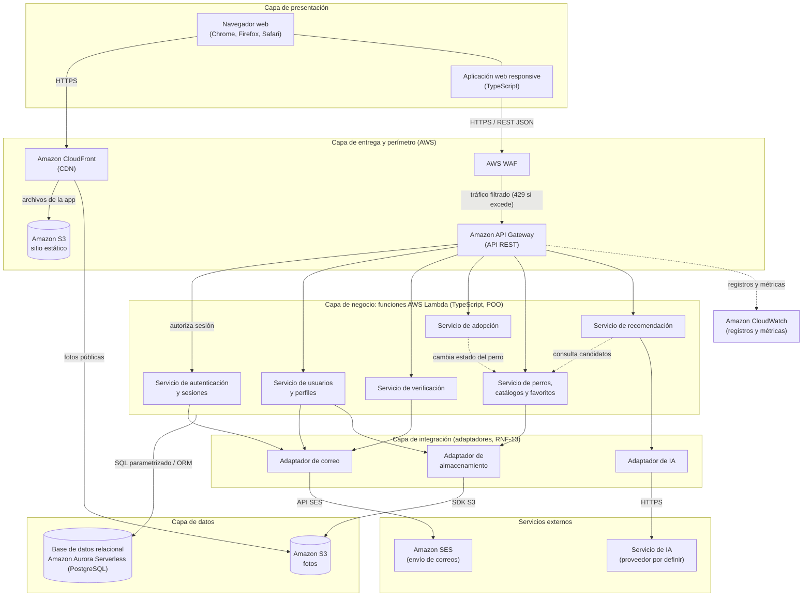

```mermaid
flowchart TB
    subgraph PRES["Capa de presentación"]
        NAV["Navegador web<br/>(Chrome, Firefox, Safari)"]
        WEB["Aplicación web responsive<br/>(TypeScript)"]
    end

    subgraph BORDE["Capa de entrega y perímetro (AWS)"]
        CF["Amazon CloudFront<br/>(CDN)"]
        S3W[("Amazon S3<br/>sitio estático")]
        WAF["AWS WAF"]
        APIGW["Amazon API Gateway<br/>(API REST)"]
    end

    subgraph NEG["Capa de negocio: funciones AWS Lambda (TypeScript, POO)"]
        AUTH["Servicio de autenticación<br/>y sesiones"]
        USR["Servicio de usuarios<br/>y perfiles"]
        VER["Servicio de verificación"]
        ADP["Servicio de adopción"]
        PER["Servicio de perros,<br/>catálogos y favoritos"]
        REC["Servicio de recomendación"]
    end

    subgraph INT["Capa de integración (adaptadores, RNF-13)"]
        AIMG["Adaptador de<br/>almacenamiento"]
        ACOR["Adaptador de correo"]
        AIA["Adaptador de IA"]
    end

    subgraph DAT["Capa de datos"]
        DB[("Base de datos relacional<br/>Amazon Aurora Serverless (PostgreSQL)")]
        S3F[("Amazon S3<br/>fotos")]
    end

    subgraph EXT["Servicios externos"]
        SES["Amazon SES<br/>(envío de correos)"]
        IA["Servicio de IA<br/>(proveedor por definir)"]
    end

    CW["Amazon CloudWatch<br/>(registros y métricas)"]

    NAV -->|HTTPS| CF
    CF -->|archivos de la app| S3W
    CF -->|fotos públicas| S3F
    NAV --- WEB
    WEB -->|HTTPS / REST JSON| WAF
    WAF -->|"tráfico filtrado (429 si excede)"| APIGW
    APIGW -->|autoriza sesión| AUTH
    APIGW --> USR
    APIGW --> VER
    APIGW --> ADP
    APIGW --> PER
    APIGW --> REC

    ADP -.->|cambia estado del perro| PER
    REC -.->|consulta candidatos| PER

    AUTH --> ACOR
    USR --> ACOR
    VER --> ACOR
    USR --> AIMG
    PER --> AIMG
    REC --> AIA

    NEG -->|SQL parametrizado / ORM| DB
    AIMG -->|SDK S3| S3F
    ACOR -->|API SES| SES
    AIA -->|HTTPS| IA
    APIGW -.->|registros y métricas| CW

```